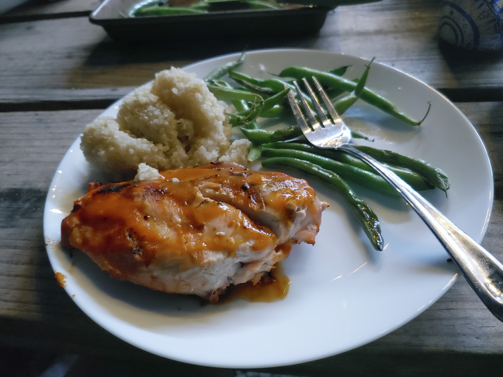

So there we were, we'd made the decision to buy a camper, something neither Sophie nor I had any experience with, and we need to learn how to do it correctly.  So its time to take a trip. 

## Where should we go?

Within 3 days of buying the camper we were on the road.  We found a campsite available on short notice at Mistletoe State Park, GA, on the beautiful Lake Thurmond.  As I'd already mentioned, I tend to look for state parks first because the sites are more spread out, and they are less expensive.

## So lets talk about our family priorities

As I discussed in the introduction post, our top priorities are spending time with our kids and showing them the world.  But, as you can imagine with Sophie being a health and wellness expert, we are particularly focused on eating healthy and teaching our kids to do the same (with some room for indulgences of course, you cant camp without s'mores!)  Continuing this practice is critical on the road, and managing how we pack food is an important part of our test runs with the camper.

## Food

While at our house, we typically visit the grocery store every few days in order to keep fresh fruits and veggies readily available for meals and snacks.  For meals we typically have a small protein, a roasted vegetable or two, and sometimes a small starch portion like brown rice.

These habits should be pretty easy to maintain in a camper as we keep fresh meats and vegetables in the fridge, and a reasonable amount of grains in fairly large pantry.  We dont have a grill for the camper yet, but think we can manage with the small kitchen and campground provided grills that are in most sites.  For this trip, we had a charcoal grill on the site!  Also, I bought a griddle plate which goes on grill to give us more options.

The first night we grilled chicken breasts with no=preservative BBQ sauce, roasted green beans in the oven, and boiled brown rice on the stovetop!

I should also mention, our food considerations are affected by allergies, as one of our sons can't have eggs, wheat, or milk.  The griddle came in handy on morning two, in making our favorite breakfast: bacon and gluten-free pancakes using [Pamela's gluten-free baking and pancake mix](https://www.pamelasproducts.com/products/gluten-free-baking-pancake-mix) and [The Neat Egg](https://www.google.com/search?ei=46-5XtXQN5HJtQbbp6eACQ&q=the+neat+egg&oq=the+neat+egg&gs_lcp=CgZwc3ktYWIQAzIECAAQQzICCAAyAggAMgQIABBDMgIIADICCAAyBAgAEB4yBggAEAUQHjIGCAAQBRAeMgQIABAeOgQIABBHOgQIABANOgYIABANEAo6BggAEAcQHjoICAAQBxAFEB5QmR5YgiFgjSJoAHABeACAAXaIAZIDkgEDMy4xmAEAoAEBqgEHZ3dzLXdpeg&sclient=psy-ab&ved=0ahUKEwiVzv3gzazpAhWRZM0KHdvTCZAQ4dUDCAw&uact=5).  We aren't sponsored by either of these products, they just meet our families need, taste good, and pack easily in the camper.

And of course, any camping trip requires a night of S'mores!

As we continue sharing about our trips, food will be topic we discuss regularly because of the importance to our family, and the challenge it poses when on the road.  Thanks for following, and until next time...

Here we tow!